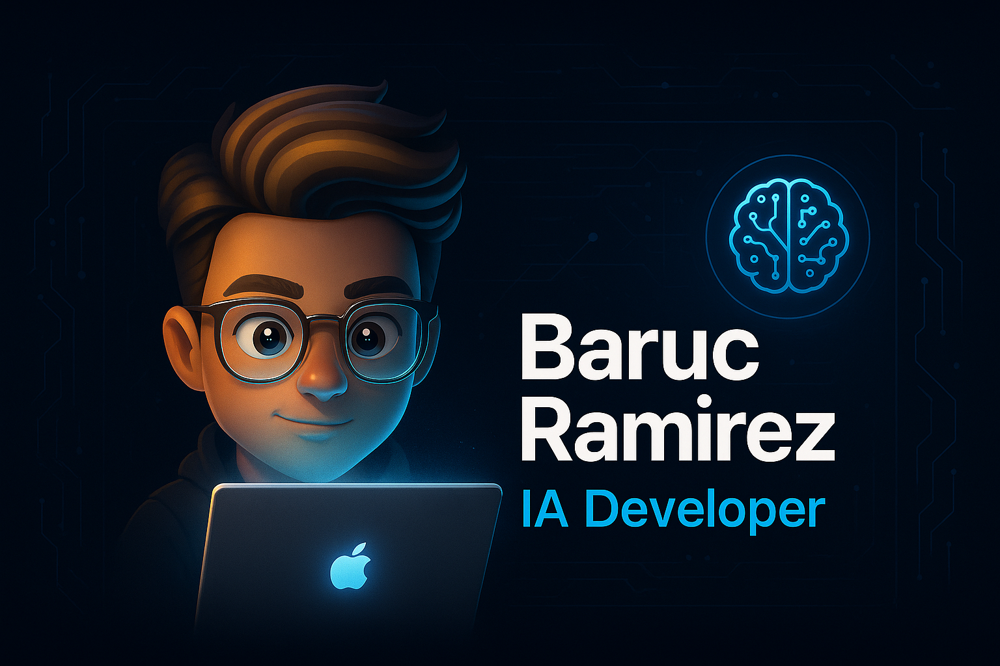

# ¡Hola! Soy Baruc Ramirez

Soy un apasionado de la **inteligencia artificial**, **desarrollo web** y la **tecnología inclusiva**. Actualmente estudio Ingeniería en Inteligencia Artificial en **Edgehub**, y estoy comprometido con crear soluciones que mejoren la vida de las personas, sin importar sus capacidades físicas o cognitivas.

## Sobre Mí
-  Técnico en Programación — CBTis 168 (2021 - 2024)
-  Estudiante de Ingeniería en IA — Edgehub
-  Apasionado por la **IA, ciberseguridad, desarrollo web y apps móviles**
- Idiomas: Español (nativo) | Inglés (intermedio/avanzado)
-  Intereses: Aprendizaje automático, accesibilidad web, emprendimiento

## 🚀 Experiencia Destacada

- **Ai for All** – Plataforma inclusiva de aprendizaje con reconocimiento de voz y señas

- **Tacos Yorch** – Página web empresarial + punto de venta con menú, paquetes, ubicación y galería

- **EduConnect** - Una plataforma todo en uno diseñada para facilitar el trabajo a los maestros.

## Tecnologías y Herramientas

## Contacto

- **Correo:** barucramirez0617@gmail.com
- **Teléfono:** +52 465 130 4889
- **Portafolio o Sitio Web:** [https://portafoliobaruc.netlify.app/]

## Frase que me representa

> _"Creo que la IA no es solo el futuro, sino la herramienta para construirlo."_ 

